# weekly-research-slides

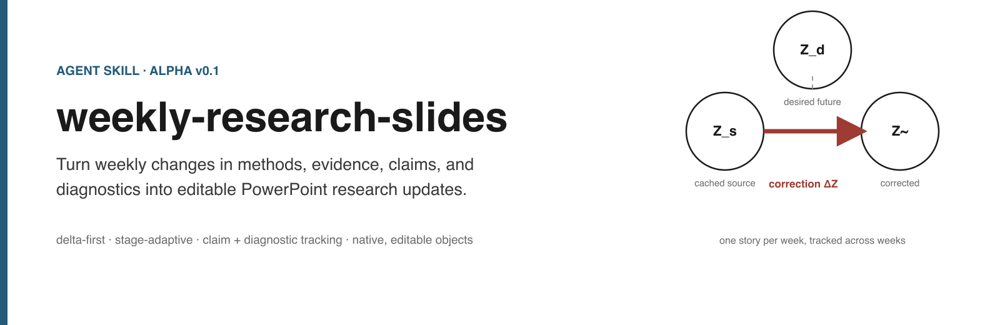

**Turn weekly changes in methods, evidence, claims, and uncertainty into visual research updates.**

[](LICENSE)
[](package.json)


An [Agent Skill](https://docs.anthropic.com/en/docs/agents-and-tools/agent-skills/overview)
for weekly research meetings with a supervisor, PI, mentor, or research group.
It is not a generic slide generator. It tracks what changed in the science
across weeks and turns that change into a concise, visually explanatory deck.
The default output is a **template-driven LaTeX Beamer PDF**; a native,
editable PowerPoint backend remains available when hand editing matters.

> **Agents: start with [Agents: read this first](#agents-read-this-first).**
> It is the operational guide for using this repository as a skill.

## Quick start with an AI agent

1. Give your agent this repository (clone it or point the agent at the URL).
2. Give it your research material: notes, results, last week's deck/state, papers.
3. Tell it what artifact you want: Beamer slides, a figure, an explainer video, or a combination.
4. Ask it to use `weekly-research-slides`.
5. Let it build, render, critique, revise, and return the result.

Minimal copy-paste prompt:

```text
Read the README and SKILL.md in this repository and use
weekly-research-slides for this task.

Prepare this week's research update from the material I provide.

Audience:
my research supervisor and lab members.

Focus on what changed since the previous update.
Do not repeat background they already know.

Generate the final academic Beamer presentation and run the complete
content, visual, and deck critique loop before returning it.
```

A universal bootstrap prompt (works for slides, figures, or video) is in
[Agents: read this first](#agents-read-this-first). Full task-specific
prompts are in [Prompt recipes](#prompt-recipes).

## Agents: read this first

This section is written for an AI agent that has been pointed at this
repository. Follow it literally.

1. **Read [`SKILL.md`](SKILL.md)** and the relevant `references/` documents.
   `SKILL.md` is the concise entry point; this README explains how to run it.
2. **Identify the task type:** weekly update, literature survey, competitor
   explanation, competitor-vs-ours comparison, method explainer video, or a
   paper figure.
3. **Inspect the user's material before writing anything.** Read the papers in
   full (not abstracts), open the notes, results, plots and previous decks.
   If previous `research_state.yaml` / `weekly_delta.yaml` / decks exist, use
   them as the baseline.
4. **Determine the research stage:** `survey`, `hypothesis-formation`,
   `method-development`, `diagnostic`, `refinement`, `mature-comparison`.
   The stage selects the story modules (see [Scientific story patterns](#scientific-story-patterns)).
5. **Build the semantic story first:** `research_state.yaml` → `weekly_delta.yaml`
   → `storyboard.yaml` → `slide_spec.yaml`. Never write layout code before the
   semantic model and storyboard exist.
6. **Select outputs and renderers.** Slides are Beamer by default; diagrams go
   through the router (TikZ / Draw.io / Python / Manim); video only when motion
   materially helps (see [Choosing the right output](#choosing-the-right-output)).
7. **Build** from source: `wrs build`, `wrs tikz`, `wrs video` scripts.
8. **Critique:** run the content, visual and deck critics; never treat a
   successful compile as success (see [Quality loop](#quality-loop)).
9. **Revise the source** (not the artifact) and rebuild. At least one revision
   cycle is mandatory; keep going until no high-severity issue remains.
10. **Report artifacts:** source files, final PDF/video, contact sheets, QA
    reports, and any unresolved limitations or assumptions.

Universal bootstrap prompt:

```text
Read this repository's README, especially "Agents: read this first", then
read SKILL.md.

Use the repository as an Agent Skill for the task below.
Do not merely give me slide text or a storyboard.
Execute the complete source → build → render → critique → revise workflow.

Task:
<describe your research task here>

Research material:
<attach or link files/papers/results>

Audience:
<supervisor / research group / conference / other>

Prior context:
<previous deck/state if available>

Desired output:
<Beamer slides / figure / explainer video / combination>
```

**Do not invent.** Never fabricate experiment results, baselines, citations,
method components, previous-week claims, novelty, or paper conclusions. If
something is unknown, mark it unknown or omit it. Do not fill research gaps
with plausible-sounding content.

## What to give your agent

You do not need perfectly structured input, and there is no form to fill in.
Useful material includes:

- research notes and rough thoughts;
- the previous week's slides, `research_state.yaml` or `weekly_delta.yaml`;
- paper URLs or PDFs;
- experiment results, plots and diagnostic outputs;
- GitHub repositories or code snippets;
- method sketches, current hypotheses, and known limitations.

More context helps. For mature projects the previous context is especially
valuable, because the skill is **delta-first**: it wants to know what changed,
not to rebuild the whole story. If previous slides or state exist, give them to
the agent.

## Why this exists

Weekly research presentations are hard for a specific reason: the value is not
in restating the project, it is in communicating **what changed** and **what it
means for the current claims**. Generic slide generators produce bullet-heavy
decks that treat every week like a fresh start and blur the line between what
was measured and what it might mean.

This skill keeps a persistent project state, computes the week's delta, and
renders an argument through a versioned academic template. The Beamer PDF is the
deliverable by default; the same source also renders an editable `.pptx`.

## Core idea: research delta (delta-first)

```text
what the audience already knows
  +  what changed in the method
  +  what new experiments ran
  +  what results moved
  +  what claims strengthened / weakened / refuted / appeared
  =  this week's deck
```

A weekly research update should generally answer:

- What changed in the method?
- What changed in the results?
- What changed in our claims?
- What new diagnostic evidence appeared?
- What do we understand differently now?
- What remains unresolved?

It should **not** automatically replay `problem → related work → motivation →
method` every week. If the audience already knows that context, compress it.

```text
Week 2 (early):                 Week 8 (mature, delta-first):
problem                         this week's question
→ competitor                    → concise recap
→ gap                           → method v7 → v8 delta
→ proposed idea                 → new result
                                → claim changed
                                → diagnostic
                                → limitation
```

For a mature project, the deck usually opens with **"What changed this week?"**
instead of a problem definition, and ends at **limitations / open questions**.
The mentor discussion happens after the deck.

## Example weekly narrative

The bundled synthetic example is a week-6 diagnostic update for a fictional
"cached future-feature prediction" project:

```text
1  title        this week's question
2  recap        where we are now
3  method delta v3 -> v4
4  geometry     two stories for what the correction does   [objects persist]
5  geometry     correction is nearly orthogonal to desired [objects persist]
6  diagnostic   D1: does the correction aim at the future feature?
7  benchmark    competitor + ours(last week) + ours(this week)
8  claim delta  C1 weakened, new C2 emerging
9  diagnostic   D2: does output recovery require feature recovery?
10 limitations  limitations + open questions
```

The demo source is in [`examples/diagnostic-week/`](examples/diagnostic-week/)
and the built deck is
[`examples/diagnostic-week/output/demo-weekly-research-slides.pptx`](examples/diagnostic-week/output/demo-weekly-research-slides.pptx).
A second, survey-stage example is in
[`examples/survey-stage/`](examples/survey-stage/) and demonstrates the
"no invented method, end at the gap" rule.

## How the agent should write research content

Good research slides and videos are **not paper summaries**. These rules apply
to every output mode.

- **One scientific idea at a time.** Every slide or scene answers one question
  or communicates one claim.
- **Explain causally.** Prefer `problem → observation → why existing methods
  fail → new idea → mechanism` over the paper's section order.
- **Minimum sufficient explanation.** Explain only what the current argument
  needs. Do not explain an entire competitor paper when one assumption matters.
- **Preserve scientific distinctions.** Never collapse measurement,
  observation, interpretation, claim, and hypothesis.
- **Evidence controls claim strength.** Never state more than the experiment
  supports.
- **Visuals carry mechanism.** If the diagram already explains an operation,
  do not repeat it in a paragraph.
- **Slides are not documents.** If something can be said aloud without losing
  comprehension, move it to speaker notes.

### Content standard (required)

> When present or explain anything, Our presentation must follow a very coherent structure that answer sequentially these question: Why we need to do this/The motivation? What are we going to do after having the requirement? Then explain what we do. You must explain very clear on what we are going to do, then present equation or proposition, theorem when we need clear formal formula to avoid vague, excessive wording. Then present experiment to support our claim if we had. The presentation must be very clear, concise, precise and connected as a complete, convincing story flow throughout the whole paper and each section, each subsection should have their own complete, convincing flow that become a perfectly fit part in the whole complete story flow of the paper. Every formula must be written in clear and easiest way to understand, all notation must be explained clearly before use. The presentation quality must be high, oral-standard, human-like with zero AI slop paragraph that throw to reader a bunch of words without truly saying anything meaningful. The complex mathematical theorem we introduce must be state clearly the message it is trying to deliver, no vague terms or jargon.

### Before / after

Verbose paper prose:

```text
Existing feature caching methods leverage the similarity of intermediate
representations across adjacent diffusion timesteps in order to reduce
redundant computation.
```

Better:

```text
Prior methods reuse nearby features.
```

If the diagram already shows the reuse:

```text
Assumption: nearby features stay similar.
```

Why: the first version repeats the figure, the second states the mechanism,
the third states the assumption the argument actually attacks.

Generic title:

```text
Feature Analysis
```

Better:

```text
Correction improves output without approaching the future feature
```

Why: a title should carry the week's argument, so the story reads from the
titles alone.

Paper prose vs spoken explanation:

```text
Heterogeneous temporal feature dynamics limit the effectiveness of a
global predictor.
```

Better (narration):

```text
The feature does not evolve the same way throughout diffusion.

So why should one predictor handle every stage?
```

Why: the first is written to be cited; the second is written to be heard and
sets up the next visual beat.

### Scientific story patterns

Reusable patterns, not a rigid deck. Omit any module the story does not need.

| Task | Pattern |
|---|---|
| Competitor method | problem → key observation → core operation → assumption → relevant weakness |
| Our method | weakness / motivation → what we change → mechanism → expected behavior → claim |
| Diagnostic | claim → alternative explanation → test → measurement → observation → updated interpretation |
| Experiment | question → controlled experiment → result → observation → interpretation |
| Survey-stage project | problem → method landscape → families of solutions → normalized comparison → unresolved gap |
| Mature weekly update | this week's question → concise recap → method delta → result delta → claim delta → diagnostics → limitations |

## Gallery

The demo source is
[`examples/diagnostic-week/slide_spec.yaml`](examples/diagnostic-week/slide_spec.yaml).
The default output is the 10-page Beamer PDF
[`output/demo-weekly-research-slides.pdf`](examples/diagnostic-week/output/demo-weekly-research-slides.pdf),
built together with a handout PDF and per-page PNG renders by `npm run demo`.

[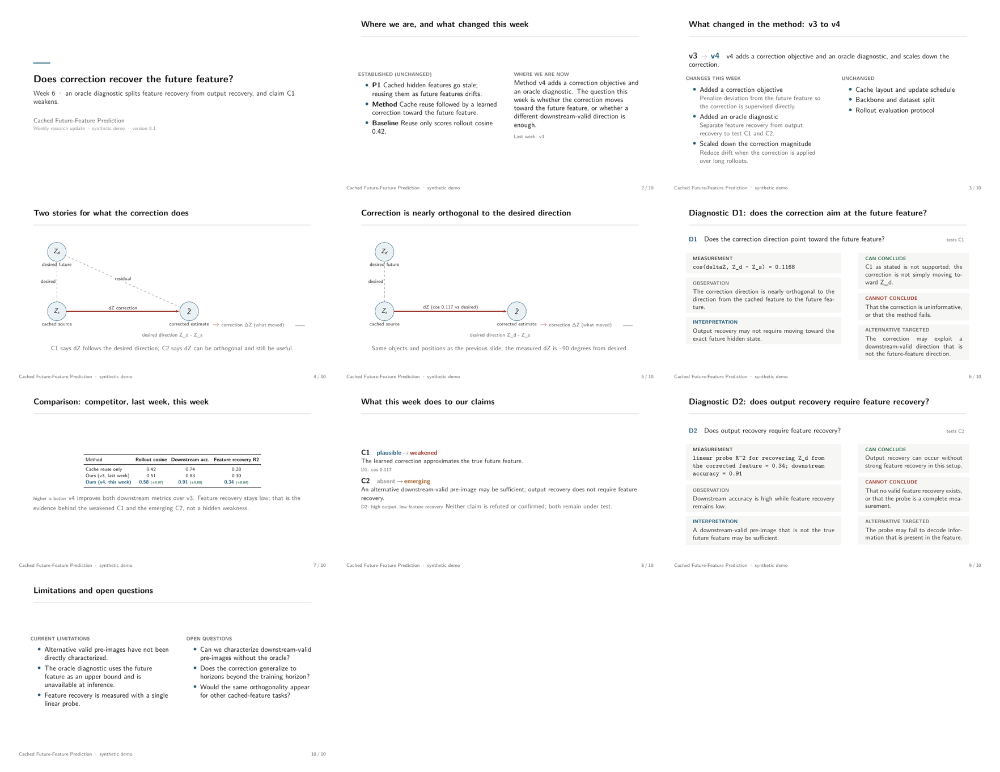](examples/diagnostic-week/output/demo-weekly-research-slides.pdf)

The contact sheet is rendered from the compiled PDF with `pdftoppm`, not from
the source scene, so it shows the actual deliverable.

## Choosing the right output

### Beamer slides (default)

The default for weekly academic presentations. Use for a research meeting, a
paper discussion, an experiment update, or a supervisor meeting.

### Static scientific figure

Use when the deliverable is a method architecture, a competitor-vs-ours
comparison, a method delta, a paper figure, or diagnostic geometry.

### Method explainer video

Use **only when motion materially improves understanding**: temporal feature
evolution, caching, iterative algorithms, attention/correspondence,
optimization dynamics, or transformations. Do not generate a video merely
because the capability exists.

### Transcript / narrated video

Use for a standalone explanation, a shareable demo, or asynchronous review.
The transcript is authored before animation and is the source of truth.

### Diagram backend routing

| Need | Preferred backend |
|---|---|
| Conceptual / math-heavy diagram | TikZ |
| Feature-space geometry | TikZ |
| Simple competitor-vs-ours | TikZ |
| Complex architecture | Draw.io |
| Reconstruct or style-transfer a reference figure | Draw.io |
| Quantitative plot | Python / PGFPlots |
| Animated mechanism | Manim |

Use `rendering.backend: auto` unless there is a reason to override it; the
router records its decision (see [Scientific diagram backends](#scientific-diagram-backends)).

## Beamer PDF (default renderer)

`wrs build` now writes a LaTeX Beamer PDF by default. The generator emits only
semantic content (`\wrsband{measurement}{...}`, `\wrsStatus{weakened}`, tikz
nodes with semantic ids); the versioned template
[`templates/academic-beamer/`](templates/academic-beamer/) owns fonts, margins,
footer, blocks and citations. Compile QA is hard-failing: a broken build, an
overfull box, a missing figure/citation or an undefined reference stops the
pipeline, because the PDF is the deliverable.

Before (legacy PowerPoint default) vs after (Beamer template), same diagnostic
slide:

| before — hand-placed PowerPoint shapes | after — compiled Beamer |
|---|---|
| 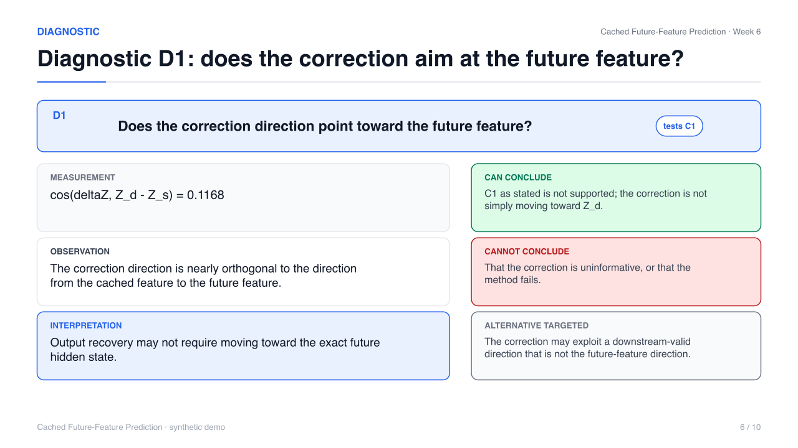 | 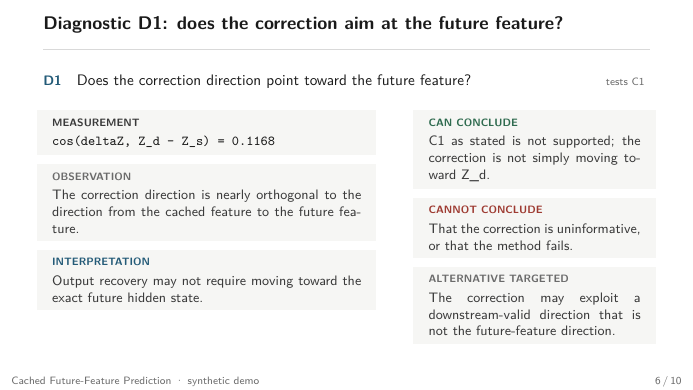 |

This is a renderer change, not a palette tweak: the new default is compiled
LaTeX (frame rules, semantic bands, booktabs tables, tikz geometry) instead of
positioned PowerPoint shapes. The PowerPoint backend is still there for native
editability.

```bash
node src/cli.js build --input slide_spec.yaml --output deck.pdf      # default
node src/cli.js build --input slide_spec.yaml --output deck.pdf \
  --render-pages                                                     # + page PNGs
node src/cli.js build --input slide_spec.yaml --output deck.pdf \
  --no-handout --engine pdflatex|lualatex|xelatex
node src/cli.js build --input slide_spec.yaml --output deck.pptx \
  --renderer pptx                                                    # legacy backend
```

See [`references/beamer-template.md`](references/beamer-template.md) for the
template contract and versioning.

## PowerPoint backend (legacy)

The native, editable PPTX path is preserved for workflows that need hand
editing, native motion, or PPTX delivery. It uses the same `slide_spec.yaml`
and the academic style system (`--style academic-beamer`, default for this
backend; `academic-metropolis` adds more whitespace and a thin progress line).

```bash
node src/cli.js build --input slide_spec.yaml --output out.pptx --renderer pptx \
  --style academic-beamer
node src/cli.js build --input slide_spec.yaml --output out.pptx --renderer pptx \
  --style academic-metropolis
```

Contact sheet: [`docs/images/gallery-contact-sheet.png`](docs/images/gallery-contact-sheet.png)
(source preview, not a PPTX rasterization). See
[`references/academic-slide-style.md`](references/academic-slide-style.md).

## Editorial critique loop

Agent-generated slides are often verbose, repetitive and visually dense. The
critique loop fixes that at the **source** and rebuilds the deck:

```text
draft -> content critic -> revision -> build
      -> visual critic  -> revision -> build
      -> deck critic    -> revision -> build + verify
```

Three critics, bounded to three cycles:

- **Content critic** — correctness, concision, redundancy, necessity, and
  whether text belongs on the slide or in the speaker notes. It prefers
  deleting/demoting over adding.
- **Visual critic** — inspects the **rendered slide image** (pixel metrics plus
  a few geometry signals); it cannot pass a slide on PPT geometry alone.
- **Deck critic** — duplicated explanation, repeated layouts, density rhythm,
  merge/delete candidates, and whether the story reads from titles.

Cycle 1 is a **deletion-only** pass (delete / merge / shorten / move to notes).
Visible text has soft budgets (title ≤ 12 words, visible ≤ 30 words, ≤ 3 text
clusters) with technical content exempt, and required scientific fields are
shortened, never removed.

Before / after on a deliberately verbose week-6 draft (**615 → 320 visible
words, 9 → 0 QA errors, one cycle**):

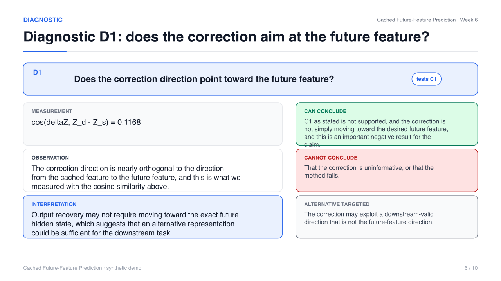
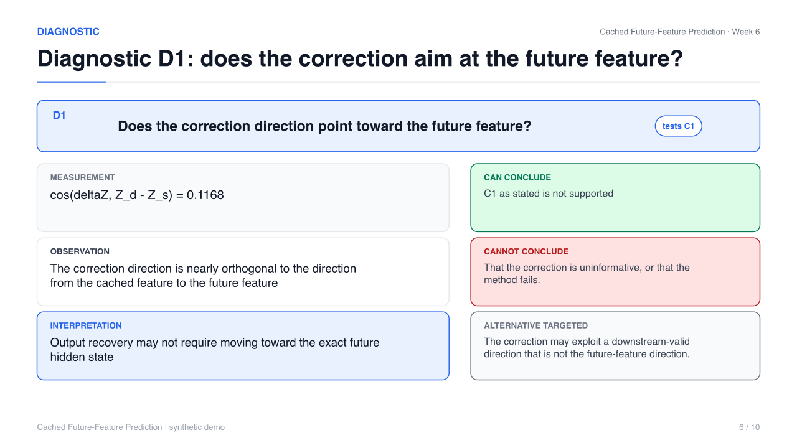

Full before/after, findings and reproduction: [`docs/critique-before-after.md`](docs/critique-before-after.md).

```bash
npm run critique:demo
node src/cli.js critique --input slide_spec.yaml --output revised.yaml \
  --renderer beamer --deck out.pdf --qa-dir qa
```

Review artifacts: `qa/{content,visual,deck}_review.json`,
`qa/editorial_metrics.json`, `qa/revision_log.md`.

## Quality loop

Generation is iterative. **Passing compilation is not sufficient.**

```text
draft
  ↓
content critic
  ↓
rewrite / delete
  ↓
render
  ↓
visual critic
  ↓
layout / figure repair
  ↓
render
  ↓
deck critic
  ↓
global revision
  ↓
final verification
```

- **Content critic** — is it correct, necessary, concise, and properly supported?
- **Visual critic** — does the rendered slide communicate clearly?
- **Deck critic** — does the complete presentation form a coherent research argument?

Every task must run all three critics and revise the source at least once; see
the implementation details above.

## Definition of a good slide

A good research slide:

- communicates one idea;
- has one dominant takeaway;
- uses the title to carry the argument when possible;
- shows rather than describes;
- contains the minimum visible text needed;
- preserves scientific precision;
- gives important figures enough space;
- uses speaker notes for spoken explanation;
- is understandable in context within seconds.

A bad research slide often:

- contains paragraphs;
- repeats what the figure already shows;
- explains unrelated background;
- uses generic titles;
- contains multiple equal-priority ideas;
- shrinks figures to fit prose.

## Definition of done for agents

A presentation task is not done until:

- scientific sources have been read;
- a storyboard exists;
- the deck builds successfully;
- all figures resolve;
- rendered slide images were inspected;
- the content, visual and deck critics were run;
- at least one revision cycle occurred;
- no high-severity unresolved issue remains;
- final artifacts are reproducible from source.

A video task additionally requires: storyboard; transcript; draft render;
visual review; pacing/voice review; revision; final render.

## Method explainer videos

Some methods are better explained with motion than with a static diagram. The
bundled **`research-method-video`** sub-skill turns the same scientific
understanding (`method_model.yaml`) into a short 3Blue1Brown-style Manim
explainer where scientific objects persist and transform, then exports keyframes
for slides.


The demo explains the central method of **LESA: Learnable Stage-Aware Predictors
for Diffusion Model Acceleration** (Cai et al., arXiv:2602.20497): why caching
diffusion features is worth doing, why a single fixed reuse/forecast scheme
fails, the stage-dependent observation, the stage-aware experts, what one expert
predictor computes, and why training becomes closed-loop. It is a silent visual
explanation; the researcher narrates live. Full keyframe grid:
[`docs/images/lesa-contact-sheet.png`](docs/images/lesa-contact-sheet.png).

```bash
npm run video:doctor
npm run video:render          # draft 480p15, concatenated to one mp4
npm run video:render:final    # 1080p60 deliverable
npm run video:qa              # frames + contact sheet + heuristics
npm run video:lint            # source-level animation lint
```

Iterate on one scene (cheap):

```bash
python skills/research-method-video/scripts/render_scene.py \
  --project examples/lesa --scene lesa_03_stage_dynamics --quality draft
```

The video and the deck share one method model, so a competitor method is never
explained two different ways. A video is only worth generating when movement
carries the argument; otherwise a static diagram is preferable.

### Paper explainers: LearniBridge and LinCa

Two acceptance-test demos that read a full paper and produce a standalone
explainer. Paper figures are not animated; the mechanisms are redrawn from the
shared visual grammar.

| | LearniBridge | LinCa |
|---|---|---|
| paper | [arXiv:2606.26778](https://arxiv.org/abs/2606.26778) | [arXiv:2608.17973](https://arxiv.org/abs/2608.17973) |
| one-sentence idea | the required cached-feature correction is low-rank and prompt-invariant, so a tiny LoRA bridge on the final block recovers skipped-timestep representations | one prediction rule cannot fit a feature whose dimensions have different continuity, so LinCa learns an invertible decomposition and predicts each group at a matched order |
| scenes | 7 | 7 |
| silent / narrated | 105.3 s / 180.6 s | 90.2 s / 130.9 s |
| voice | Gemini TTS, voice **Kore** (3.1 Flash TTS) | Gemini TTS, voice **Kore** (2.5 Flash TTS, cheaper) |
| contact sheet | [`examples/learnibridge/qa/contact-sheet.png`](examples/learnibridge/qa/contact-sheet.png) | [`examples/linca/qa/contact-sheet.png`](examples/linca/qa/contact-sheet.png) |
| revision log | [`examples/learnibridge/qa/revision-log.md`](examples/learnibridge/qa/revision-log.md) | [`examples/linca/qa/revision-log.md`](examples/linca/qa/revision-log.md) |

```bash
python skills/research-method-video/scripts/render_scene.py --project examples/learnibridge \
  --quality final --timing transcript --concat examples/learnibridge/renders/final/learnibridge-method-explainer.mp4
python skills/research-method-video/scripts/tts_narration.py --project examples/learnibridge --backend gemini
python skills/research-method-video/scripts/mux_narration.py --project examples/learnibridge --quality final --backend gemini
```

Cost note: TTS audio is cached on `model + voice + prompt`, so re-rendering the
animation never re-bills the voice; only narration or delivery changes do. Both
narrations together cost roughly **$0.20** (Kore, ~5 min of audio at 25 audio
tokens/s). End-frame padding: LearniBridge 0.0 s; LinCa 1.8 s total with no
scene above 0.9 s. Both videos were reviewed by frame inspection and self-review
against the comprehension gates, not by a human panel.

## Transcript and narration

Narration is a first-class part of the video pipeline, written **before**
animation and reviewed together with the visual beats:

```text
method model -> storyboard -> narration script + visual beats
             -> timed transcript -> Manim -> video
```

Three modes share one canonical transcript:

- **silent** (default) — no audio; the script sets per-beat dwell and scene
  holds, so pacing follows the words. Best for weekly meetings.
- **tts** — Gemini TTS is the preferred backend (voice `Kore`, expressive
  prosody, audio cached on `model + voice + prompt`); macOS `say` is the local
  zero-account fallback. Actual audio duration drives scene pacing.
- **recorded** — force-align a recording to the canonical text with WhisperX
  when installed, else a clearly-labelled estimate. The text is never replaced by
  ASR output.

The same transcript produces sidecar subtitles (`transcript.srt`,
`transcript.vtt`) and a speaker-notes manifest (`speaker_notes.yaml`) for the
deck.

```bash
npm run transcript:build     # narration.md + transcript.json + srt/vtt + word_times
npm run transcript:qa        # narration, linking, subtitle and pacing checks
npm run transcript:notes     # transcript -> speaker_notes.yaml
npm run transcript:tts       # optional TTS (Gemini preferred, say fallback)
npm run transcript:align -- --audio narration.wav
npm run video:narrate        # mux narration onto the rendered scenes
```

The optional **narrated** demo (local macOS `say`, no cloud account) is
committed at
[`examples/lesa/renders/final/lesa-method-explainer-narrated.mp4`](examples/lesa/renders/final/lesa-method-explainer-narrated.mp4)
— 110.3 s, 1080p60 with AAC audio. The canonical demo remains the silent,
script-paced render; audio is a backend.

A LESA excerpt (`examples/lesa/transcript/narration.md`), rewritten for an
**adjacent researcher**:

> Early on, noise is high and change is fast and uneven.
> In the middle, change becomes small and smooth.
> Near the end it barely moves: only details are refined.
> One trajectory, three behaviours. Call them stages.
> Why should one predictor handle all three?

Animation shows *what* changes; narration explains *why* it matters.

## Scientific diagram backends

One semantic figure spec, several renderers, one Beamer deck:

```text
                     SCIENTIFIC CONTENT
                            |
                 semantic figure spec / Figure IR
                            |
                  renderer selection (recorded)
        +-------------------+-------------------+------------------+
        v                   v                   v                  v
      TikZ              Draw.io            Python/PGFPlots       Manim
  conceptual,         large editable      quantitative         animated
  math-heavy          architecture        plots                explanations
        |                   |                   |                  |
        v                   v                   v                  v
   native .tex         PDF/SVG ->           plot assets          MP4
   inside Beamer       \includegraphics
        +-------------------+-------------------+
                            v
                      one Beamer PDF
```

TikZ is the default for small-to-medium conceptual and math-heavy diagrams.
Draw.io is not replaced: it stays the backend for large, editable, reconstructed
architecture figures. The router records why it chose a backend:

```bash
wrs route --input examples/diagram-backends/large_architecture.figure.yaml
# -> drawio: figure type 'architecture' is an architecture-scale view;
#            16 semantic objects (TikZ budget 12); 18 edges (TikZ budget 15)
```

| TikZ: feature-space geometry | TikZ: competitor vs ours |
|---|---|
| 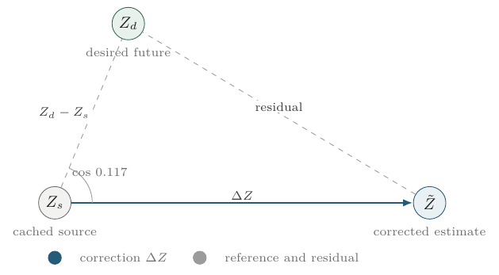 | 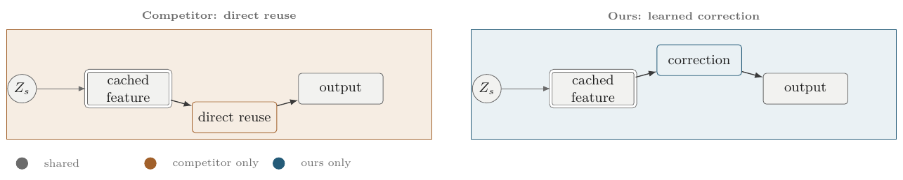 |

| TikZ: method delta | Mixed deck: TikZ + Draw.io + Beamer |
|---|---|
| 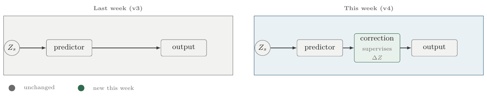 | 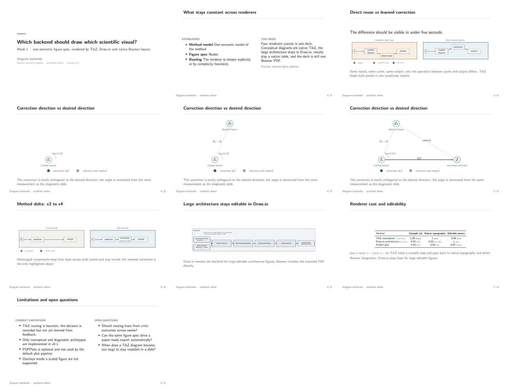 |

The mixed deck in [`examples/diagram-backends/`](examples/diagram-backends/)
compiles native TikZ figures, a Draw.io PDF export and Beamer-native slides
into one PDF — with progressive overlays in presentation mode (10 pages) and a
collapsed handout (8 pages). Figures inherit the Beamer palette and math
typography; there are no rasterized labels.

```bash
npm run demo:figures
wrs route   --input figure_spec.yaml [--json]
wrs tikz    --input figure_spec.yaml --output figure.tex --standalone out/
wrs tikz:qa --input figure_spec.yaml --output-dir qa/figure
```

Policy, grammar, archetypes and the QA/repair loop:
[`references/diagram-routing.md`](references/diagram-routing.md),
[`references/tikz-visual-grammar.md`](references/tikz-visual-grammar.md),
[`references/tikz-archetypes.md`](references/tikz-archetypes.md),
[`references/tikz-qa.md`](references/tikz-qa.md).

## Scientific method figures

The Draw.io backend. It remains the editable, architecture-scale path: large
system views, style extraction, reconstruction, and frequent manual editing.

The same method model also drives publication-quality, editable figures. The
bundled **`research-method-figure`** sub-skill keeps `.drawio` as the canonical
editable source and exports SVG, PDF and PNG, plus native PowerPoint shapes.

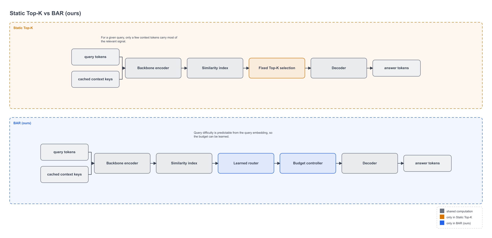

Comparison figures normalize both methods into one visual language with a single
shared style profile: shared components are gray, competitor-only amber, ours
blue. Only the real structural difference is visible.

Method-delta and style-transfer examples:
[`figure-method-delta.png`](docs/images/figure-method-delta.png),
[`figure-style-transfer.png`](docs/images/figure-style-transfer.png).

### Style extraction and transfer

A reusable style profile is extracted from a reference figure — palette,
typography hierarchy, module geometry, edge grammar — and applied to *different*
scientific content. The reference is classified as a `STYLE_SOURCE` only, so its
labels and architecture are never copied.

```bash
npm run figure:doctor
npm run figure:compare     # competitor vs ours, normalized
npm run figure:delta       # our v3 vs v4
npm run figure:extract     # reference.svg -> styles/user/<name>.yaml
npm run figure:qa
```

### One method, three carriers

The LESA method model that produces the Manim video also produces a figure and
the slide source, so one method is never explained three different ways. Figure:
[`docs/images/figure-lesa.png`](docs/images/figure-lesa.png).

## Features

- **Delta-first workflow** — compute `weekly_delta.yaml` from two research
  states, or supply one directly.
- **Stage-adaptive** — `survey`, `hypothesis-formation`, `method-development`,
  `diagnostic`, `refinement`, `mature-comparison`. The stage suggests modules;
  it does not lock the deck.
- **Persistent research state** — `research_state.yaml` remembers problem,
  competitors, method versions, claims, diagnostics, results, limitations.
- **Versioned claims and diagnostics** — claim states `new`, `emerging`,
  `plausible`, `unchanged`, `strengthened`, `weakened`, `refuted`; each
  diagnostic links to the claims it tests.
- **Epistemic separation** — measurement, observation, interpretation, claim,
  and hypothesis are never collapsed.
- **Beamer PDF by default** — a versioned LaTeX template
  (`templates/academic-beamer/`, version 1) owns presentation; the generator
  emits semantic macros and tikz with semantic ids only.
- **Compile QA** — hard failures on compile errors, overfull boxes, missing
  figures/citations and undefined references; handout PDF and `pdftoppm` page
  renders from the same build.
- **Native, editable PPTX (legacy backend)** — text boxes, shapes, arrows. No
  screenshot decks. Every object has a stable semantic name.
- **Object permanence** — reused ids keep objects in place across slides;
  Morph-ready by construction.
- **Scientific + geometry + continuity + package QA** and an optional native
  OOXML motion pass.
- **Inspection and conservative editing** of external PPTX files.
- **Narrated method videos** — transcript-first pipeline with Gemini TTS
  (Kore) or the local `say` fallback, semantic chunking, subtitles, speaker
  notes, and audio-driven scene pacing.
- **Diagram backend routing** — TikZ, Draw.io, Python/PGFPlots or Manim chosen
  by a router that records why (`wrs route`).
- **Source-first** — edit structured source, rebuild; do not patch the artifact.

## Installation

Portable skill install:

```bash
npx skills add https://github.com/thanhlamauto/weekly-research-slides \
  --skill weekly-research-slides
```

Manual install:

```bash
git clone https://github.com/thanhlamauto/weekly-research-slides.git \
  ~/.agents/skills/weekly-research-slides
cd ~/.agents/skills/weekly-research-slides && npm install
```

The skill lives in [`SKILL.md`](SKILL.md); detailed guidance is in
[`references/`](references/).

## Quick start (CLI)

```bash
npm install
npm run doctor          # runtime + optional tools
npm run demo            # build + QA the bundled example deck
```

Build a deck and run QA (Beamer PDF is the default):

```bash
npm run build -- --input examples/diagnostic-week/slide_spec.yaml --output out.pdf
npm run qa   -- --input out.pdf --spec examples/diagnostic-week/slide_spec.yaml

# legacy editable PPTX backend
npm run build -- --input examples/diagnostic-week/slide_spec.yaml --output out.pptx --renderer pptx
npm run qa   -- --input out.pptx --spec examples/diagnostic-week/slide_spec.yaml
```

## Prompt recipes

Copy-paste prompts for the most common tasks. Replace the bracketed parts.
The universal bootstrap prompt is in
[Agents: read this first](#agents-read-this-first).

### A. Weekly update from notes

```text
Read this repository's README and SKILL.md and use weekly-research-slides.

Prepare this week's research presentation from the notes and results I provide.

Audience:
my supervisor and research group.

Use the previous presentation/project state if available.

Focus on:
- what changed in the method;
- what changed in the results;
- what changed in our claims;
- new diagnostics;
- current limitations.

Do not repeat familiar background unless necessary.

Generate the academic Beamer deck, render it, run the content/visual/deck
critique loop, revise the source, and return the final PDF plus relevant
source artifacts.
```

### B. Early-stage literature survey

```text
Use weekly-research-slides in survey mode.

Read the papers I provide.

Do not summarize each paper independently. Instead:
1. identify the common problem;
2. group methods by core strategy;
3. normalize them into the same visual language;
4. explain the important assumption of each family;
5. identify unresolved weaknesses/gaps.

Generate an academic Beamer presentation.

There is no method of ours yet, so do not invent one.
```

### C. Explain one competitor

```text
Use the research method explainer workflow.

Read this paper in full and explain only the parts necessary to understand its
central mechanism and the weakness relevant to our research.

Structure the explanation as:
problem → key observation → mechanism → why it works → assumption → limitation

Do not follow paper section order.

Create concise academic slides and a normalized method figure.
```

### D. Compare competitor vs our method

```text
Use weekly-research-slides to compare the competitor method and our current
method.

Redraw both methods using the same visual grammar and coordinate system.

Emphasize:
- shared components;
- the minimal structural difference;
- the different underlying assumption;
- how our method addresses the relevant weakness.

Do not paste the original competitor figure beside our diagram.
```

### E. Update last week's deck

```text
Update the previous research presentation using weekly-research-slides.

Treat last week's deck/state as known context. Do not recreate the presentation
from scratch.

Identify:
- method delta;
- result delta;
- claim delta;
- new diagnostics;
- resolved or new limitations.

Only reintroduce background when required to understand those changes.
```

### F. Make a method explainer video

```text
Use the research-method-video skill.

Read the paper in full.

Target audience:
an adjacent researcher who understands machine learning but not this specific
subfield.

First create:
method model → scientific story → storyboard → spoken narration → scene spec

Then generate the Manim video.

Do not animate screenshots of paper figures. Animate scientific objects and
preserve object identity.

Use the current narration/TTS backend if configured.

Render a draft, inspect frames and narration, revise at least once, then
produce final silent and narrated videos.
```

### G. Draw a paper method figure

```text
Use the scientific figure workflow.

Create a publication-quality method figure from the method model.

The figure should communicate the mechanism with minimal text.

Use TikZ for conceptual/math-heavy structures or Draw.io when the architecture
is complex.

Render the output, inspect it, fix overlaps/readability problems, and return
editable source plus vector export.
```

### Prompting does not require micro-management

You generally only need to specify: the goal, the audience, the source
material, what changed or what matters, and the desired artifact. The skill
decides slide count, layout, diagrams, typography and animation pacing from the
research story and the QA loops.

Bad prompt: *"Make exactly 12 slides with 3 bullets each."*

Better prompt: *"Prepare a concise update for my supervisor focused on why our
current claim changed after these diagnostics."*

### When the agent should ask questions

Agents should avoid unnecessary clarification. If sufficient evidence exists,
make a best-effort presentation. Ask only when missing information would
materially change scientific meaning, for example an ambiguous experiment
baseline, an unclear metric, an unknown previous method version, or conflicting
result files. Do not ask aesthetic questions that the template already decides.

## Architecture

[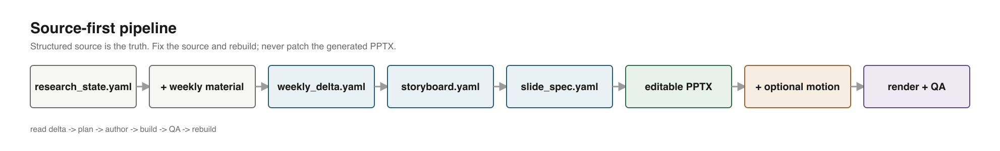](docs/images/architecture.png)

```text
research_state.yaml + weekly material
        |
        v
  weekly_delta.yaml        wrs diff / hand-authored
        |
        v
  storyboard.yaml          wrs plan / hand-authored
        |
        v
  slide_spec.yaml          the renderable source of truth
        |
        +--> semantic Beamer source      wrs build --output deck.pdf   [default]
        |         |
        |         v
        |    compile + log QA (pdflatex/latexmk)
        |         |
        |         v
        |    presentation.pdf + handout.pdf + page renders (pdftoppm)
        |
        +--> scene -> editable PPTX      wrs build --output deck.pptx --renderer pptx
                  |
                  v
             optional motion         wrs build --motion m.yaml
```

The default pipeline needs a TeX distribution (TeX Live or TinyTeX) with
`pdflatex`/`latexmk` and Poppler's `pdftoppm`; `wrs doctor` reports the exact
state. The PPTX backend uses `pptxgenjs`, `js-yaml`, `ajv`, `jszip`, and
`fast-xml-parser`. No hosted backend either way.

## Research state and claim tracking

```yaml
project: { title: ..., stage: diagnostic, week: 6, familiarity: high }
problem: { id: P1, summary: ..., status: stable }
competitors:
  reuse_only: { familiarity: high, summary: ..., weakness: ... }
method:
  current_version: v4
  previous_version: v3
  versions: [{ version: v4, changes: [...] }]
claims:
  C1: { statement: ..., status: weakened, diagnostics: [D0, D1] }
  C2: { statement: ..., status: emerging,  diagnostics: [D2] }
diagnostics:
  D1:
    supports_or_tests: [C1]
    measurement: cos(deltaZ, Z_d - Z_s) = 0.1168
    observation: ...
    interpretation: ...
    can_conclude: ...
    cannot_conclude: ...
```

Run `wrs diff` to get the week-over-week delta, then `wrs plan` to get the
argument skeleton, then author the `slide_spec.yaml`.

## Renderers and editability

The default output is a Beamer PDF: the generator writes semantic LaTeX and the
versioned template renders it. To change a deck, change `slide_spec.yaml` and
rebuild; generated `.tex` is reproducible and never patched.

The legacy PowerPoint backend builds native objects in this order of preference:

1. native PowerPoint objects (text, shapes, connectors),
2. editable vector content,
3. layered raster only when unavoidable (never for the normal path).

In the PPTX backend the user can open the result in PowerPoint and move,
restyle, or delete any object. Object names are semantic (`concept-zs`,
`claimdelta-C1`, `diag-D1-measurement`) so diagrams survive authoring and are
Motion-ready.

## Project structure

```text
weekly-research-slides/
├── SKILL.md                  # concise skill entry + workflow
├── README.md
├── LICENSE  CONTRIBUTING.md  CHANGELOG.md
├── package.json
├── references/               # progressive-disclosure guidance
├── schemas/                  # research_state, weekly_delta, storyboard, slide_spec, motion_spec
├── templates/
│   └── academic-beamer/      # versioned Beamer template (theme.tex, macros.tex)
├── scripts/                  # make_docs_assets.js, pdf_contact_sheet.py, slide_image_metrics.py
├── src/
│   ├── model/                # validate.js, plan.js, diff.js
│   ├── renderer/             # scene.js, buildScene.js, pptxRenderer.js, svgRenderer.js, theme.js
│   ├── layouts/              # narrative.js, method.js, evidence.js, common.js
│   ├── visual-grammar/       # draw.js
│   ├── beamer/               # renderTex.js (semantic LaTeX), build.js (compile + log QA + pages)
│   ├── pptx/                 # inspect.js, edit.js, motion.js
│   ├── qa/                   # geometry.js, continuity.js, scientific.js, pptxPackage.js
│   └── cli.js
├── assets/README.md
├── skills/
│   ├── research-method-video/   # method -> Manim explainer
│   └── research-method-figure/  # method -> editable scientific figure (drawio/svg/pdf/png/pptx)
├── examples/                 # diagnostic-week, survey-stage, lesa, figure-comparison, figure-style-transfer
├── docs/                     # architecture.md, gallery.md, gallery/, images/
└── tests/
```

## Commands

| command | purpose |
|---|---|
| `wrs doctor` | runtime, optional tools, and the LaTeX/Beamer stack |
| `wrs build --input slide_spec.yaml --output out.pdf [--render-pages] [--no-handout] [--engine pdflatex]` | render semantic LaTeX, compile (hard QA), handout PDF, page PNGs |
| `wrs build --input slide_spec.yaml --output out.pptx --renderer pptx [--motion m.yaml] [--preview dir]` | legacy native PPTX + optional motion |
| `wrs qa --input out.pdf --spec slide_spec.yaml [--build-dir dir] [--report r.json]` | PDF checks + compile-log QA + scientific/geometry/continuity QA |
| `wrs qa --input out.pptx --spec slide_spec.yaml [--delta d.yaml] [--report r.json]` | scientific + geometry + continuity + package QA |
| `wrs render --input deck.pdf --output dir/` | render PDF pages to PNG + contact sheet |
| `wrs render --input deck.pptx --output dir/` | rasterize PPTX (LibreOffice) or render source previews |
| `wrs critique --input slide_spec.yaml --deck out.pdf --renderer beamer` | source-first critique loop with PDF page inspection |
| `wrs inspect --input deck.pptx [--json]` | list shapes, names, text, geometry |
| `wrs edit --input deck.pptx --ops ops.yaml --output deck2.pptx` | conservative edits |
| `wrs plan --state state.yaml [--delta d.yaml] [--stage diagnostic]` | emit `storyboard.yaml` |
| `wrs diff --prev a.yaml --curr b.yaml` | emit `weekly_delta.yaml` |
| `wrs validate --schema slide_spec --input spec.yaml` | schema validation |
| `wrs demo` | build + QA the bundled example (PDF + PPTX + page renders) |
| `npm run video:doctor` | check Python, Manim, ffmpeg, LaTeX |
| `npm run video:render` / `video:render:final` | render the LESA explainer (draft / final) |
| `npm run video:qa` | extract frames, contact sheet, heuristics |
| `npm run video:lint` | source-level animation lint |
| `npm run figure:doctor` | figure runtime + font + renderer check |
| `npm run figure:build` | build a figure from a method model |
| `npm run figure:compare` | normalized competitor-vs-ours comparison figure |
| `npm run figure:delta` | method-delta figure (v3 vs v4) |
| `npm run figure:extract` | extract a style profile from a reference |
| `npm run figure:qa` | geometric preflight + preview + defect log |
| `npm run figure:pptx` | native PowerPoint shapes from the figure IR |

## Current limitations

- **Beamer needs a local TeX distribution.** The default pipeline requires
  `pdflatex` (or `lualatex`/`xelatex` for non-Latin-1 content), `latexmk` or the
  engine itself, and `pdftoppm` for page renders. Without them the build fails
  with an actionable message and the PPTX backend still works.
- **Beamer frames are static.** Overlays/progressive disclosure are not emitted;
  `beats` drive the speaker notes and PPTX motion instead. Handout mode drops
  notes by design.
- **No native PPTX rasterization by default.** If LibreOffice (`soffice`) is
  installed, `wrs render --input deck.pptx` converts the real deck. Otherwise
  source previews are vector renders from the same scene used to build the
  PPTX. PPTX gallery assets are source-rendered and labeled as such.
- **No Morph generation.** The deck is Morph-ready (stable names and positions)
  but Morph transitions are not injected in v0.1.
- **Edit support is conservative.** `set_text`, `move`, `resize`, and
  `annotate` only. No arbitrary PowerPoint editing.
- **Benchmarks are tables, not charts.** Native charts and equation objects are
  on the roadmap; no figure ingestion yet.
- **Speaker notes are generated**; rehearsal tooling (teleprompter, practice
  timing) is not part of v0.1.
- **Video: narration is supported, but no Morph and no arbitrary Manim→PPTX
  conversion.** Gemini TTS or local `say` produce the narrated track; the
  PowerPoint bridge exports the MP4 plus keyframe stills and a manifest.
  Animation patterns are authored in Manim per scene, not generated from a
  general interpreter.
- **Video rendering needs Manim + ffmpeg locally.** Without them the video tests
  and render steps are skipped, and the deck pipeline is unaffected.
- **Figures: draw.io is canonical; no native `.drawio` rasterizer.** SVG/PDF/PNG
  are produced by our own renderer, so the drawio CLI is optional. Style
  extraction from raster images recovers palette and density but not fonts or
  exact geometry, and records that as low confidence. Reconstruction is
  agent-assisted, not a universal automatic converter.
- **TikZ is used only inside the Beamer template** (feature-space geometry and
  method pipelines). It is not a general figure backend; draw.io remains the
  editable figure source.

## Roadmap

- Native PPTX rendering QA loop (LibreOffice/PowerPoint) with visual diffs.
- Morph transition generation from object continuity.
- Native charts for benchmark slides and equation objects for diagnostics.
- Figure/asset ingestion from a local `figures/` directory.
- Richer external-PPTX editing (shape duplication, style transfer, slide copy).
- Additional example: `mature-weekly-update`.
- Video: a general pattern interpreter and richer PowerPoint keyframe insertion.
- Figures: an optional TikZ backend, `.drawio` → IR round-trip for external
  editing, and richer reconstruction fidelity.

## Inspirations and acknowledgements

Architecture and concepts were studied from these MIT-licensed projects. No
bundled visual assets or templates were copied, and large code blocks were not
reused; concepts were reimplemented.

- [`siril9/presentation-skill`](https://github.com/siril9/presentation-skill) —
  source-first deck generation, structured outlines, editable native PPTX,
  geometry QA, render/rebuild loops.
- [`qybaihe/codex-ppt`](https://github.com/qybaihe/codex-ppt) — storyboard-first
  workflow, per-slide planning, visual QA.
- [`yinzige/pptx-motion-lite`](https://github.com/yinzige/pptx-motion-lite) —
  lightweight OOXML post-processing, grouped-click reveals, native entrance
  transitions. The `src/pptx/motion.js` injector is a JavaScript
  reimplementation of this concept (MIT).
- [`hugohe3/ppt-master`](https://github.com/hugohe3/ppt-master) — native object
  philosophy and template-preserving workflows.
- [`LikC1606/lab-meeting-report-skill`](https://github.com/LikC1606/lab-meeting-report-skill)
  — source-grounded lab-meeting reporting and honest handling of negative
  results.

For the Beamer renderer, design principles were studied from
[LaTeX Beamer](https://ctan.org/pkg/beamer) (GPL-2.0-or-later / LPPL-1.3c) and
the [Metropolis theme](https://github.com/matze/mtheme) (CC BY-SA 4.0). No
code, fonts or assets are reused; `templates/academic-beamer/` is an independent
implementation that depends on the user's own TeX distribution.

For the figure sub-capability, concepts were studied from these projects (no
bundled assets copied; code was reimplemented):

- [`holdyounger/drawio-diagram-builder`](https://github.com/holdyounger/drawio-diagram-builder)
  (MIT) — separate content/structure/style/layout sources, style extraction
  before drawing, top-conference visual rules, geometric pre-flight, screenshot
  → defect → repair.
- [`Agents365-ai/drawio-skill`](https://github.com/Agents365-ai/drawio-skill) (MIT)
  — persistent style presets, learning a style from `.drawio` or a flat image,
  iterative self-check.
- [`sxy1499894281/drawio-reconstruction-skill`](https://github.com/sxy1499894281/drawio-reconstruction-skill)
  (MIT) — reference decomposition, element inventory, editability boundaries,
  drawio → editable PPTX mapping.
- [`pengqianhan/codex-paper-figure-skill`](https://github.com/pengqianhan/codex-paper-figure-skill)
  (MIT) — composition exploration and editable-first reconstruction.
- [`Ztsdut/ml-architecture-diagram-skill`](https://github.com/Ztsdut/ml-architecture-diagram-skill)
  (MIT) — architecture IR, semantic roles, separating computation fidelity from
  figure design, multiple editable carriers.
- [`PM-Shawn/tikz-scientific-figures`](https://github.com/PM-Shawn/tikz-scientific-figures)
  — publication sizing and vector PDF/SVG concepts only; no license file was
  present at inspection time, so no code was reused.

For the video sub-capability, concepts were studied from these projects (no
bundled assets copied; code was reimplemented):

- [`AmitSubhash/3brown1blue`](https://github.com/AmitSubhash/3brown1blue) (MIT) —
  paper-explainer workflow, machine-learning visual patterns, scene planning.
- [`albertobarnabo/manim-craft`](https://github.com/albertobarnabo/manim-craft) —
  visual continuity, morph-over-fade, still-frame review, contact-sheet
  inspection. No license file was present at inspection time, so only concepts
  were used, no code.
- [`adithya-s-k/manim_skill`](https://github.com/adithya-s-k/manim_skill) (MIT) —
  composer/storyboard before coding, identifying the aha moment.
- [`Yusuke710/manim-skill`](https://github.com/Yusuke710/manim-skill) (MIT) —
  packaging and verification patterns.
- [`ahkamboh/chalktalk`](https://github.com/ahkamboh/chalktalk) (MIT) — environment
  bootstrap, no-LaTeX mode, render/verify scripts.
- [Manim Community Edition](https://www.manim.community/) (MIT) — the renderer.

The unique focus here is **research reasoning across weeks**.

## Contributing and license

See [`CONTRIBUTING.md`](CONTRIBUTING.md). Released under the
[MIT License](LICENSE). The bundled example is synthetic and fictional.
