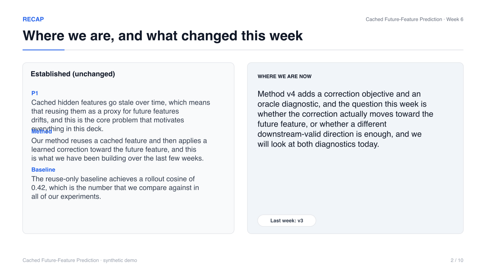
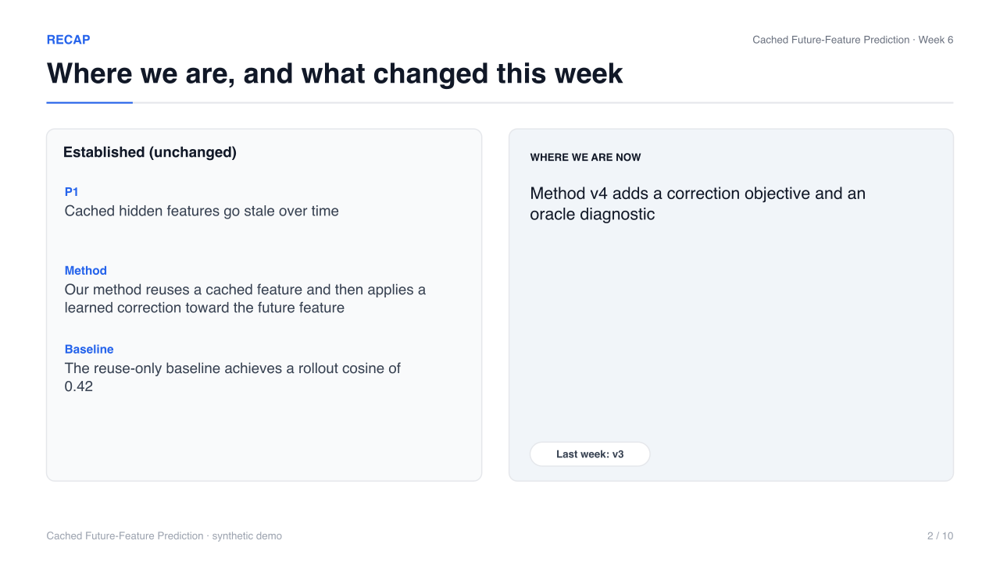

# Editorial critique loop — before / after

The critique loop is source-first: it revises `slide_spec.yaml` and rebuilds the
deck. It never patches the generated PPTX.

```text
draft -> content critic -> revision -> build
      -> visual critic  -> revision -> build
      -> deck critic    -> revision -> build + verify
```

## Run 1 — deliberately verbose draft

`examples/diagnostic-week/draft_verbose_slide_spec.yaml` is the same week-6 story
with verbose, narration-like copy (the kind of first draft the loop exists to
fix). The loop ran **1 cycle**, applied **18 changes**, and finished with
**0 hard failures** and **0 unresolved high-severity issues**; the rebuilt deck
passes geometry, scientific and package QA with **0 errors**.

| metric | draft | revised |
|---|---|---|
| visible words | 615 | 320 (−48%) |
| speaker-note words | 134 | 429 |
| slides | 10 | 10 |
| QA errors | 9 | 0 |

### Slide s6 — diagnostic

Before: `CAN CONCLUDE` overflowed its band, and observation/interpretation ran
to three lines.


Representative content findings (from `examples/diagnostic-week/critique/content_review.json`):

```yaml
- slide: s6
  critic: content
  severity: medium
  issue: long_field
  reason: '"The correction direction is nearly orthogonal to…" is 28 words'
  action: keep the first sentence on the slide, move the rest to notes
  applied: true
- slide: s6
  critic: visual
  severity: high
  issue: geometry_geometry
  reason: Likely text overflow: needs ~0.75in in 0.64in (3 lines)
  action: fix the layout in the source
```

The revision kept `observation`, `interpretation` and `can_conclude` on the
slide (they are required or meaningful), shortened each to its leading clause,
and moved the remainder to speaker notes. The measurement is untouched.

### Slide s2 — recap

Before: 123 visible words. After: three concise established points; the `now`
paragraph reduced to its claim.




The recap's `established` items are protected from deletion (a recap needs its
points) and shortened instead; the loop also refuses to empty any list.

## Run 2 — the current, already-tight deck

Run on `examples/diagnostic-week/slide_spec.yaml` itself, the loop made **6
changes**, kept all 10 slides, and reduced visible words **442 → 361** with 0
hard failures. It does not rewrite a deck that is already acceptable.

## Artifacts

- `examples/diagnostic-week/critique/content_review.json`
- `examples/diagnostic-week/critique/visual_review.json`
- `examples/diagnostic-week/critique/deck_review.json`
- `examples/diagnostic-week/critique/editorial_metrics.json`
- `examples/diagnostic-week/critique/revision_log.md`
- `examples/diagnostic-week/critique/{before,renders}/contact-sheet.png`
- `examples/diagnostic-week/revised_verbose_slide_spec.yaml`
- `examples/diagnostic-week/output/demo-weekly-research-slides-revised.pptx`

## Reproduce

```bash
npm run critique:demo
# or
node src/cli.js critique \
  --input examples/diagnostic-week/draft_verbose_slide_spec.yaml \
  --output examples/diagnostic-week/revised_verbose_slide_spec.yaml \
  --deck examples/diagnostic-week/output/demo-weekly-research-slides-revised.pptx \
  --qa-dir examples/diagnostic-week/critique
```
