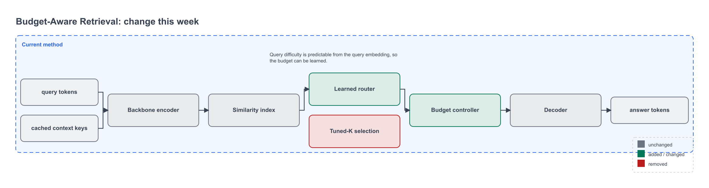
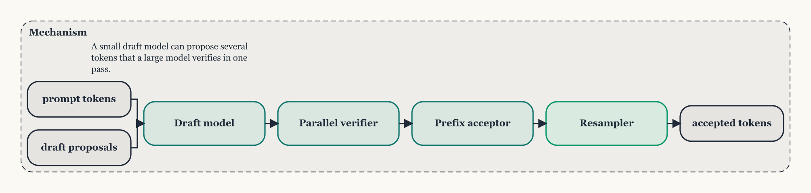
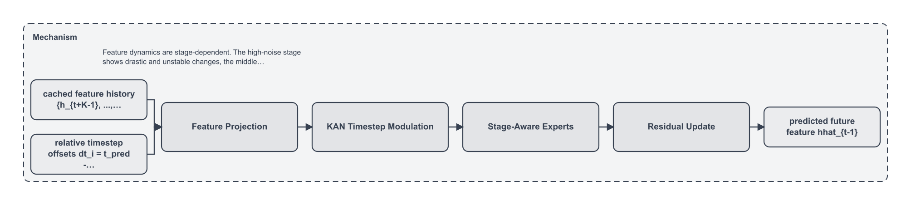

# Figure gallery — normalized comparison and style transfer

Synthetic demo. No third-party figure or text is redistributed.

## Competitor vs ours, one visual language

`examples/figure-comparison/` builds three figures from two method models and one
style profile (`topconf-clean`):

- `competitor.drawio` — Static Top-K retrieval
- `ours.drawio` — Budget-Aware Retrieval (BAR)
- `comparison.drawio` — both, stacked, shared components gray, competitor-only
  amber, ours-only blue
- `method_delta.drawio` — BAR v3 → v4, unchanged muted, added green, removed red




Reproduce:

```bash
python skills/research-method-figure/scripts/compare_methods.py \
  --left examples/figure-comparison/competitor_method.yaml \
  --right examples/figure-comparison/ours_method.yaml \
  --left-label "Static Top-K" --right-label "BAR (ours)" \
  --style topconf-clean --output examples/figure-comparison/output/comparison.drawio

python skills/research-method-figure/scripts/method_delta.py \
  --prev examples/figure-comparison/ours_method_v3.yaml \
  --curr examples/figure-comparison/ours_method.yaml \
  --style topconf-clean --output examples/figure-comparison/output/method_delta.drawio
```

## Style extraction and transfer

`examples/figure-style-transfer/` contains a reference figure authored inside
this repository (`reference.svg`). Its style is extracted into
`styles/user/paper-style.yaml`, then applied to *different* content
(draft-and-verify decoding):



The output shares the reference's cream background, serif typography, large
corner radius, teal accent and edge grammar, while the science is ours. The
reference is classified `STYLE_SOURCE` only in `source_inventory.yaml`.

```bash
python skills/research-method-figure/scripts/extract_style.py \
  --reference examples/figure-style-transfer/reference.svg --name paper-style
python skills/research-method-figure/scripts/build_figure.py \
  --method examples/figure-style-transfer/subject_method.yaml \
  --style paper-style --output examples/figure-style-transfer/output/subject_paper_style.drawio
```

## One method, three carriers

The LESA `method_model.yaml` that drives the Manim video also drives a static
figure (`examples/lesa/figure/lesa_overview.drawio`), so the method is never
explained three different ways.



## QA and repair

Every figure runs the geometric pre-flight and a preview render. The comparison
figure went through real repair cycles documented in
`examples/figure-comparison/qa/repair-log.md` (8 errors → 0). The PPT bridge
(`figure_to_pptx.js`) emits native, editable shapes with the same semantic
object names.
