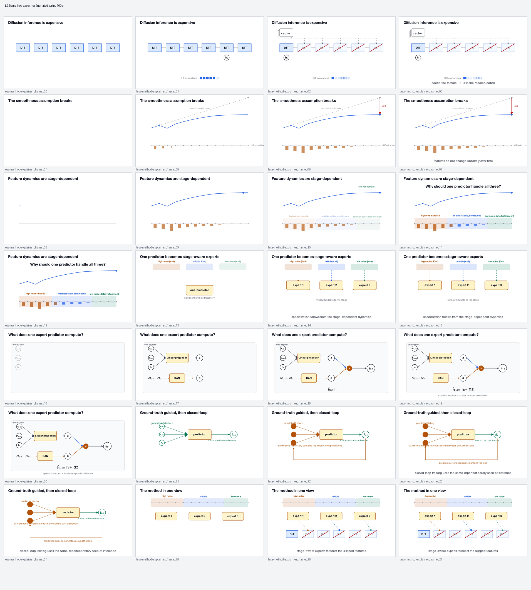

# LESA — method explainer video

**Paper:** *LESA: Learnable Stage-Aware Predictors for Diffusion Model
Acceleration*. Peiliang Cai, Jiacheng Liu, Haowen Xu, Xinyu Wang, Chang Zou,
Linfeng Zhang. arXiv:[2602.20497](https://arxiv.org/abs/2602.20497) (v3, 27 May
2026). This gallery entry is an independent visual explanation produced from the
paper; it does not imply endorsement by the authors.

**What it explains:** the *central LESA method*, not the whole paper and not the
leaderboard. Roughly 64 seconds, silent (the researcher narrates live).

## Storyboard overview

| # | Scene | Question answered |
|---|---|---|
| 01 | Why cache diffusion features? | Why is feature caching worth doing? |
| 02 | The smoothness assumption breaks | Why is simple reuse/forecast not enough? |
| 03 | Feature dynamics are stage-dependent | Why does one fixed predictor struggle? |
| 04 | One predictor becomes stage-aware experts | How should the predictor adapt? |
| 05 | What does one expert predictor compute? | What is inside a single predictor? |
| 06 | Ground-truth guided, then closed-loop | Why not just train on ground-truth features? |
| 07 | The method in one view | What is LESA, in one view? |

Persistent actors (`feature_point`, `trajectory`, `predictor`, `stage_high/mid/low`,
`expert_1..3`, `dit_blocks`) keep their identity across scenes; the same feature
trajectory is reused in scenes 02, 03 and 07.

## Preview



An animated preview is committed at `docs/images/lesa-preview.gif`; the full
MP4 is committed at
`examples/lesa/renders/final/lesa-method-explainer.mp4`.

## Reproduce

```bash
# one-time environment
python3.13 -m venv .venv-manim
. .venv-manim/bin/activate
pip install -r skills/research-method-video/requirements.txt

# draft (fast) and final (1080p60)
python skills/research-method-video/scripts/render_scene.py --project examples/lesa \
  --quality draft --concat examples/lesa/renders/draft/lesa-method-explainer.mp4
python skills/research-method-video/scripts/render_scene.py --project examples/lesa \
  --quality final --concat examples/lesa/renders/final/lesa-method-explainer.mp4

# one scene while iterating
python skills/research-method-video/scripts/render_scene.py \
  --project examples/lesa --scene lesa_05_expert_internals --quality draft

# QA and PowerPoint keyframes
python skills/research-method-video/scripts/qa_video.py \
  --input examples/lesa/renders/final/lesa-method-explainer.mp4 --output examples/lesa/qa
python skills/research-method-video/scripts/export_keyframes.py \
  --project examples/lesa --quality final \
  --video examples/lesa/renders/final/lesa-method-explainer.mp4
```

## Artifacts

- `examples/lesa/method_model.yaml` — semantic model extracted from the paper.
- `examples/lesa/storyboard.md` — the argument plan.
- `examples/lesa/scene_spec.yaml` — actors, beats, keyframes.
- `examples/lesa/src/` — Manim scenes.
- `examples/lesa/qa/contact-sheet.png`, `qa/keyframes.yaml` — QA and bridge.
- `examples/lesa/renders/final/lesa-method-explainer.mp4` — the deliverable.

## Limitations

- Silent; no narration or subtitles.
- The paper's quantitative results are intentionally not reproduced as the
  conclusion; the video ends on the mechanism.
- Some notation is simplified (a 1-D projection of the feature trajectory
  illustrates the PCA picture from Figure 2 of the paper).
